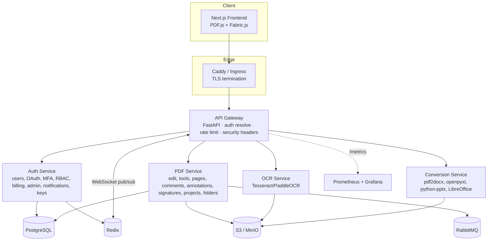
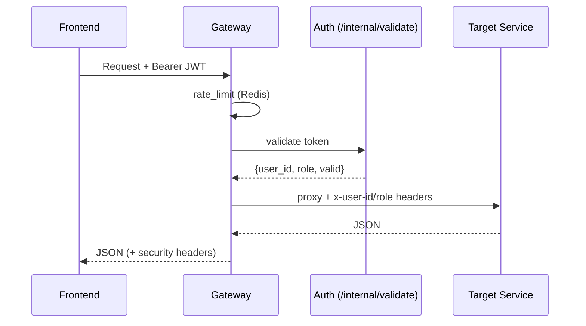
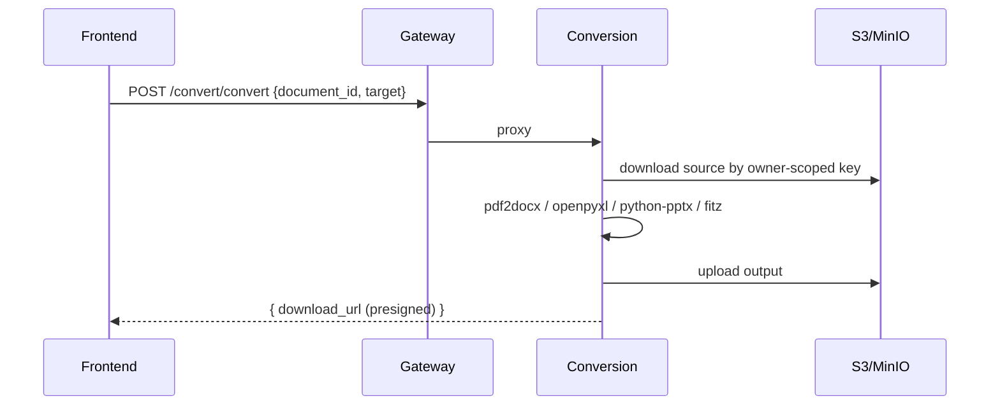
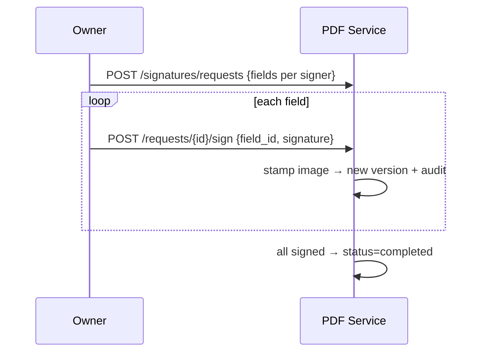
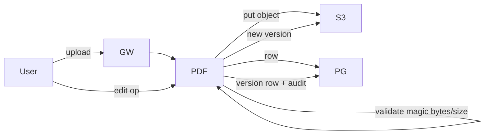

# PDFForge — Architecture

## 1. System Architecture

## 2. Service responsibilities
- **Gateway** — single entry; resolves JWT / cookie / `X-API-Key` → injects `x-user-*` headers; per-IP rate limit (Redis); security headers; Prometheus `/metrics`; WebSocket fan-out via Redis pub/sub.
- **Auth** — register/login/refresh/reset/verify, OAuth, MFA, RBAC (`/permissions`), admin, billing (Stripe), notifications, API keys.
- **PDF** — documents CRUD, edits (text/draw/shape/image/highlight/redact/watermark), page tools, versions, comments, annotations, signatures, projects, folders, tables.
- **OCR** — image→text, searchable PDF.
- **Conversion** — PDF↔Office, PDF→image/text, office→PDF.

## 3. Sequence — authenticated request

## 4. Sequence — PDF conversion

## 5. Sequence — multi-signer signature

## 6. Data Flow — upload & edit

## 7. API Architecture
- REST under `/api/v1/*`, routed by prefix in the gateway `SERVICE_MAP`.
- Auth via `Authorization: Bearer`, cookie fallback, or `X-API-Key`.
- Heavy/long work is idempotent and returns presigned URLs; queue (RabbitMQ) for async jobs.
- OpenAPI/Swagger per service at `/docs`.
- Realtime: `/ws/documents/{id}` (gateway) backed by Redis pub/sub.

## 8. Infrastructure
- **Local/self-host:** Docker Compose (+ `tls` and `monitoring` profiles). See SELF_HOSTED.md.
- **Cloud:** Kubernetes manifests in `kubernetes/` (Deployments/Services/Ingress/HPA/Secrets/ConfigMap) for EKS; managed Postgres (RDS), Redis (ElastiCache), RabbitMQ (Amazon MQ), S3, CloudFront.
- **CI/CD:** GitHub Actions (`.github/workflows/ci.yml`, `cd.yml`).
