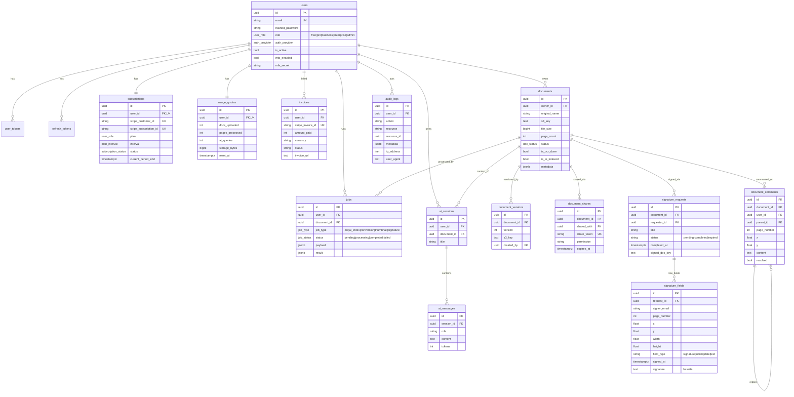

# Entity-Relationship Diagram

**Authoritative schema:** `database/migrations/001_init.sql` (applied to Postgres on init).
This diagram reflects that canonical schema. A `create_user_quota` trigger seeds a
`usage_quotas` and `subscriptions` row whenever a `users` row is inserted.



## Schema management

The schema is currently created by `database/migrations/001_init.sql` on first DB init
(idempotent enums/tables/triggers). Per-service SQLAlchemy models in each
`*/models.py` map a subset of these tables for ORM use. Converging all schema changes onto
Alembic (baselined from `001_init.sql`) is tracked as Infra-increment work.
```
